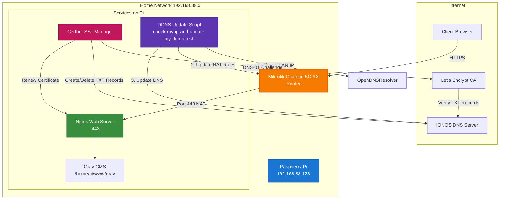

# Network Architecture

## Components

### External Services
- **Let's Encrypt CA**: Issues SSL/TLS certificates via DNS-01 challenge
- **IONOS DNS**: Authoritative DNS server and API for dynamic updates
- **OpenDNS**: Used to discover current WAN IP address

### Home Network
- **Mikrotik Router**: Handles NAT/Port Forwarding for HTTPS (443) traffic
- **Raspberry Pi** (`192.168.88.123`):
  - **Nginx**: Web server handling HTTPS requests
  - **Grav CMS**: Content management system
  - **Certbot**: Automated SSL certificate renewal
  - **DDNS Script**: Keeps DNS and NAT rules updated with current WAN IP

## Data Flow

### 1. Dynamic DNS Updates
1. Script queries OpenDNS to get current WAN IP
2. If IP changed: Update router NAT rules via SSH
3. Update IONOS DNS records via API
4. Store new IP for future comparisons

### 2. SSL Certificate Renewal
1. Certbot initiates renewal with Let's Encrypt
2. Certbot creates TXT record via IONOS API (`_acme-challenge`)
3. Let's Encrypt queries DNS to verify domain ownership
4. Certificate issued and Nginx reloaded
5. Certbot cleans up TXT record via IONOS API

### 3. Client Access
1. Client requests `https://yourdomain.com`
2. DNS resolves to current WAN IP (via IONOS)
3. Router forwards :443 to Raspberry Pi
4. Nginx serves content from Grav CMS
