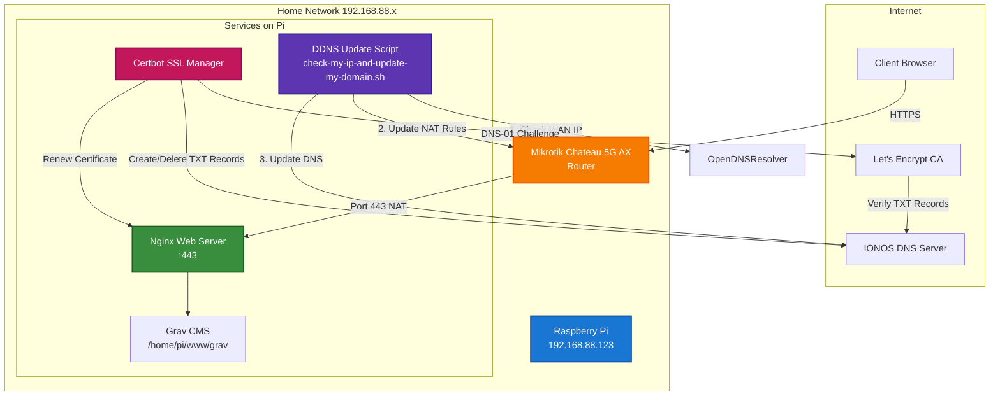

# Сүлжээний Бүтэц (Network Architecture)

## Бүрэлдэхүүн хэсгүүд

### Гадаад үйлчилгээнүүд
- **Let's Encrypt CA**: DNS-01 аргаар SSL/TLS сертификат олгоно
- **IONOS DNS**: Эрх бүхий DNS сервер болон динамик шинэчлэлтийн API
- **OpenDNS**: Одоогийн WAN IP хаягийг олоход ашиглагдана

### Гэрийн сүлжээ
- **Mikrotik Router**: HTTPS (443) траффикийн NAT/Port Forwarding-ийг удирддаг
- **Raspberry Pi** (`192.168.88.123`):
  - **Nginx**: HTTPS хүсэлтийг боловсруулдаг вэб сервер
  - **Grav CMS**: Контент удирдлагын систем
  - **Certbot**: SSL сертификат автоматаар сунгах
  - **DDNS Script**: DNS болон NAT дүрмүүдийг одоогийн WAN IP-тэй зохицуулж байдаг

## Өгөгдлийн урсгал

### 1. Динамик DNS шинэчлэлт
1. Скрипт OpenDNS-рүү хандаж одоогийн WAN IP-г авна
2. Хэрэв IP өөрчлөгдсөн бол: Роутерын NAT дүрмүүдийг SSH-ээр шинэчлэнэ
3. IONOS DNS бичлэгийг API-аар шинэчлэнэ
4. Шинэ IP-г ирээдүйн харьцуулалтад зориулж хадгална

### 2. SSL сертификатын сунгалт
1. Certbot Let's Encrypt-рүү сунгалтыг эхлүүлнэ
2. Certbot IONOS API-аар TXT бичлэг үүсгэнэ (`_acme-challenge`)
3. Let's Encrypt домэйн эзэмшлийг баталгаажуулахаар DNS-рүү хандана
4. Сертификат олгогдож, Nginx дахин ачаална
5. Certbot IONOS API-аар TXT бичлэгийг цэвэрлэнэ

### 3. Хэрэглэгчийн хандалт
1. Хэрэглэгч `https://blog.tsengel.de/mn` хандана
2. DNS одоогийн WAN IP руу чиглүүлнэ (IONOS-оор)
3. Роутер :443 портыг Raspberry Pi руу дамжуулна
4. Nginx Grav CMS-аас контент үзүүлнэ
