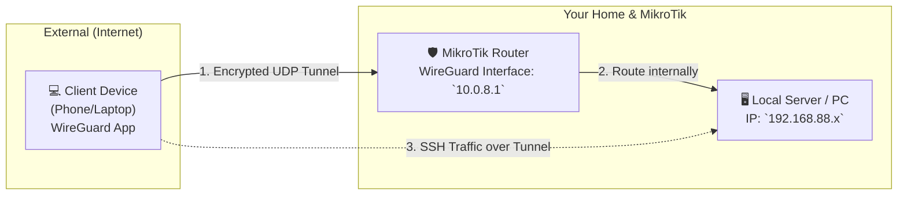
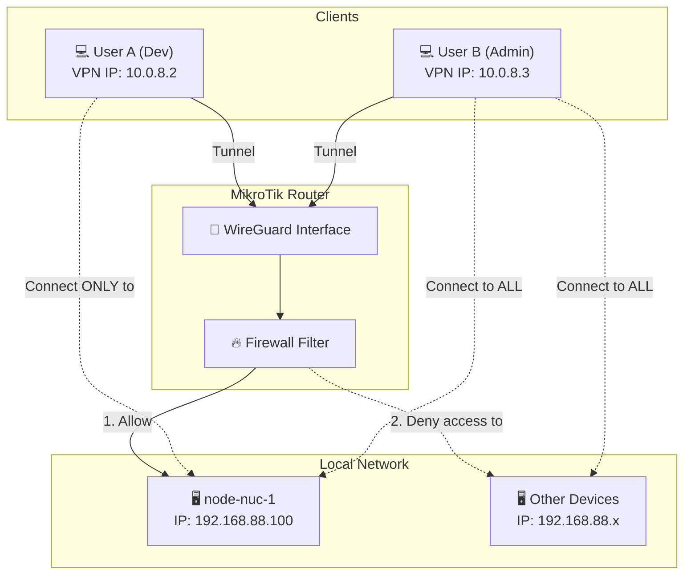

# WireGuard VPN Documentation

This document describes the setup and usage of the WireGuard VPN connection into your MikroTik router network.

## 📂 File Directory Structure

To keep everything clean & organized, client configuration templates are stored separately in the **`clients/`** folder:

*   **`clients/bachka-gaming-pc/wg0.conf`** -> **This is YOUR configuration.**
*   `clients/template-other-user/wg0-template.conf` -> A template for any **future devices** you want to add (Phones, Laptops).

Each device requires its own separate config file, IP address incrementation (e.g., `10.0.8.3`), and its own unique keypair.

---

### 📋 SOP: Adding a New User Checklist

Here is your straightforward checklist to scale this connection:

1.  **The User**: Generates their keys (instructions below) and sends only their **Public Key** to you.
2.  **You (The Admin)**: Run the script command in your workspace:
    ```bash
    ./add-client.sh <Name> "<User-Public-Key>" <Virtual-IP>
    ```
3.  **You**: Send the generated local file `clients/<Name>/wg0.conf` back to the user.
4.  **The User**: Opens the file, pastes their secret **Private Key** into that list, and turns the VPN **ON**.

---

### 🔧 Automation Script: `add-client.sh`

To add future users/devices swiftly WITHOUT clicking through the router UI:

**Run command**:
```bash
./add-client.sh <CLIENT_NAME> <CLIENT_PUBLIC_KEY> <VPN_INTERNAL_IP>
```

*Note: `<VPN_INTERNAL_IP>` is the static **Virtual VPN IP** inside the private tunnel pipe (e.g., `10.0.8.3`). Wireguard handles actual Dynamic IPs from the internet automatically.*

**What is does**:
1.  **Router**: Logs in via SSH and automatically registers the new Peer instantly.
2.  **Local Workspace**: Creates a new folder `clients/<CLIENT_NAME>/` with a pre-filled `wg0.conf` template!

**Example**:
```bash
./add-client.sh pixel-phone "lfIcbSD..." 10.0.8.3
```

---

## ✅ Confirmed Router Details
1.  **RouterOS Version**: **7.12.2** (WireGuard supported).
2.  **DDNS Mode**: Enabled & Updated to `hgf09jjw17x.sn.mynetname.net`.

To access with your domain, you have created a **CNAME record** pointing `vpn.tsengel.de` to that `dns-name`.

---

## 🗺️ How it Works (Network Schema)



### 🛠️ Client Software Requirements
Users **must install software** on the device that connects from the internet:
*   **Desktop**: [wireguard.com](https://www.wireguard.com/install/)
*   **Mobile**: WireGuard App from App Store / Play Store.

---

## 🔑 Keys & SSH Access Breakdown (No Jargon)

To be absolute precise on how this is secure **WITHOUT** sharing secret keys:

Both your **MikroTik Router** and your **Laptop** generate their own **Keypair** (a Public Key and a Private Key).

1.  **Public Key (Safety to share)**:
    *   This is added to the *opposite* device.
    *   The **Router** knows your Laptop's Public key.
    *   Your **Laptop** knows the Router's Public key.

2.  **Private Key (Must be kept Secret)**:
    *   **Router's Private Key**: Stays locked inside the Router.
    *   **Your Private Key**: Stays inside your local file on your Laptop.

#### 🤝 The Calculation (How it connects)
When connecting, they combine their secrets together:
*   **Your Laptop** calculates a secret using: `[Your Private Key]` + `[Router's Public Key]`
*   **The Router** calculates a secret using: `[Router's Private key]` + `[Your Public Key]`

Because of mathematical formulas, **both calculations create the exact same Shared Secret code on both sides**. No Private Key is ever sent or loaded to other devices. Both compute the same lock separately.

---

### 🔑 How to Create Your Client Keys
To connect to Wireguard, each client device (laptop/phone) must have its own unique **Private** & **Public** keypair.

#### 🐧 1. On Linux (Command Line)
Run this exact command in your terminal:
```bash
wg genkey | tee privatekey | wg pubkey > publickey
```
*   **`privatekey`**: Open this file and paste its contents into your client configuration file as the `PrivateKey`.
*   **`publickey`**: Open this file, copy its contents, and send it to the Admin so they can bind it to the Router!

#### 🪟 2. On Windows / macOS (WireGuard App)
1. Open the WireGuard App.
2. Click the arrow next to **Add Tunnel** or click **+**.
3. Choose **Create Empty Tunnel...**
4. A window will open showing a **PrivateKey** and **PublicKey** already generated for you! 
5. Just copy the Public Key and send it to the Admin.

---

### 🔑 Keys vs SSH Keys Distinction
1.  **WireGuard Connection**: 
    - uses its **own keypair** for the network tunnel pipe.
    - You **do not** put your SSH key into WireGuard.
2.  **SSH Access**:
    - **Works over VPN**. Once connected, your Laptop acts as if inside the Wi-Fi.
    - SSH to your user@192.168.x.x directly.

---

## 🔒 Access Control (Restricting Users)

If you have multiple users and want to restrict their access (e.g., User A can only access `node-nuc-1`), we use **Firewall Rules**.

### 🗺️ Access Control Schema



### 🛠️ How to Configure User Restrictions

**1. Step 1: Assign a Predictable IP to each Peer**
In the WireGuard configuration, assign static allowed addresses:
- **User A**: Allowed Address `10.0.8.2/32`
- **User B**: Allowed Address `10.0.8.3/32`

**2. Step 2: Add Firewall Filter Rules**
Allow access to target device first, lock out remainder.

```routeros
# Rule 1: Allow User A to connect to NUC-1 over SSH (Port 22)
/ip firewall filter add chain=forward src-address=10.0.8.2 dst-address=192.168.88.100 protocol=tcp dst-port=22 action=accept comment="Allow User A to SSH to NUC-1"

# Rule 2: Drop User A accessing anything else in the local network
/ip firewall filter add chain=forward src-address=10.0.8.2 dst-address=192.168.88.0/24 action=drop comment="Deny User A accessing local network"
```

---

## 📋 End-User Guide: How to Connect

Connecting is a simple **3-step process**:

### 1. 📥 Install the WireGuard App
The user **must install the WireGuard software**:
-   **Linux / Windows / macOS**: Official client setup.
-   **Android / iOS**: Download app store.

### 2. 🔑 Import Configuration
Load the generated generic text file (`.conf`) or QR code.
-   **Desktop**: `Add Tunnel` -> Select Configuration file.
-   **Action**: Toggle the switch to **ON**.

### 3. 🖥️ Connect via SSH
Open your terminal and use the **Local IP** of the target machine:
```bash
ssh username@192.168.88.x
```

---

## 🛡️ Safety & Impact Assessment

*   **DDNS Activation**: 100% passive and safe. Not modifying existing rules.
*   **Local Rules (Nginx/Pi)**: Unaffected. Local IP configuration remains identical.
*   **SSL Certificates**: Wireguard does NOT use certificate authentication. Your webserver website continues using its standard certificate scripts safely independently.
